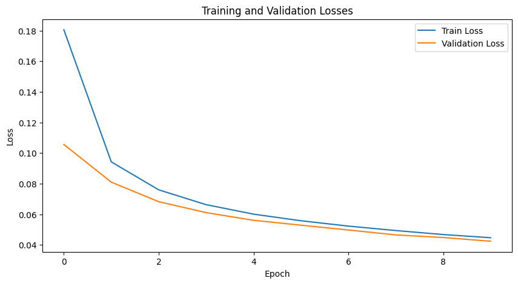

# Autoencoder for MNIST 🧠
An **Autoencoder** is a neural network designed to learn efficient representations (encodings) of data in an unsupervised manner. The network is trained to compress data into a lower-dimensional latent space and then reconstruct the original data from this latent representation. This project implements a simple autoencoder to reconstruct handwritten digits from the MNIST dataset and visualize the latent space over time.

---
## 📚 Key Concepts
### 1. **Autoencoder Architecture**
- **Encoder**: Compresses the input image (28x28 pixels) into a 32-dimensional latent vector.
- **Decoder**: Reconstructs the original image from the 32-dimensional latent space.
  
### 2. **Loss Function**
- The training process minimizes Mean Squared Error (MSE), which measures the difference between the input and its reconstruction:

MSE = (1/n) * Σ(yᵢ - ŷᵢ)²

---

## 🌟 Why Autoencoders?

1. **Dimensionality Reduction**: Autoencoders learn compact representations of data, useful for visualization and compression.
2. **Generative Modeling**:  Once trained, autoencoders can generate new samples by sampling from the latent space.
3. **Unsupervised Learning**: Autoencoders do not require labeled data and can be applied to various unsupervised tasks.

---

## 🛠 Example Applications

- **Image Reconstruction**: The autoencoder is trained to reconstruct images from compressed latent vectors.
- **Latent Space Visualization**: Using techniques like t-SNE or PCA, we can visualize how the model organizes the data in a lower-dimensional latent space.
- **Loss Tracking**: Both training and validation losses are tracked over epochs to monitor the learning process.

## Learning Latent Representations

The latent space of an autoencoder represents how the model encodes data into a lower-dimensional form. During training, the model learns to group similar images (e.g., handwritten digits) closer together in the latent space. We can visualize this space using t-SNE or PCA to observe how the autoencoder learns to organize the data.

The following animation illustrates how the latent space evolves over training epochs, using t-SNE for dimensionality reduction. As the model trains, the separation between different digit classes becomes more defined.

!Figure: Latent space evolution visualized using t-SNE.

## Generative Power of the Model

OAfter training, the autoencoder can generate new images by sampling from the learned latent space. The animation below shows how the model's reconstruction improves as training progresses. Each epoch produces better image quality and more recognizable digits as the model becomes proficient at encoding and decoding.

## Training Process and Loss Function

The training process minimizes the reconstruction loss (MSE) to improve the model's ability to recreate images from the latent space. The following plot illustrates the training and validation losses over epochs, showing a steady decrease in loss as the model learns to better reconstruct images.

After training, the autoencoder can generate highly accurate reconstructions of handwritten digits, as shown below:

