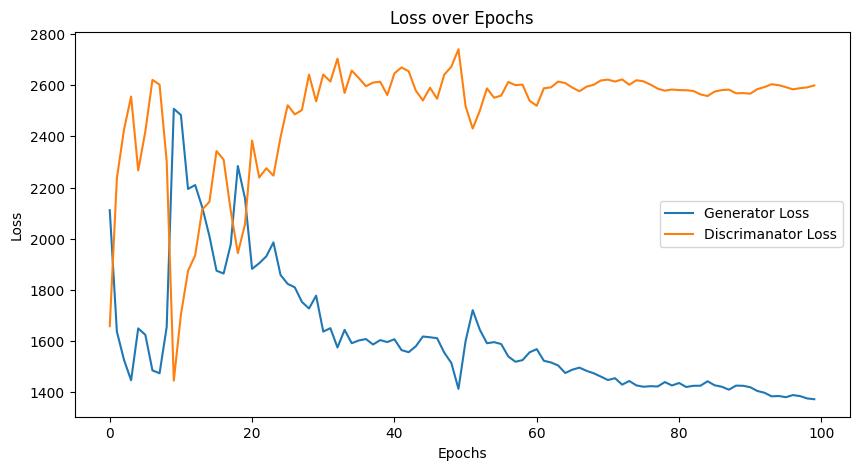
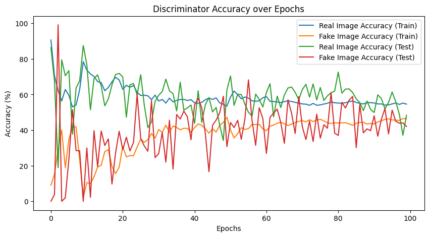
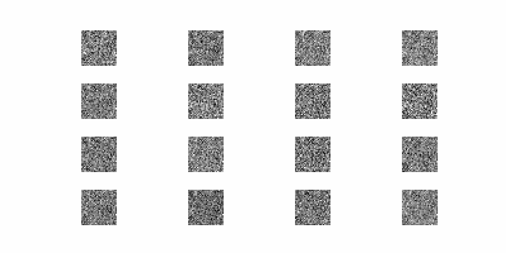

# Generative Adversarial Networks (GANs)

## Introduction

A **Generative Adversarial Network (GAN)** is a type of neural network architecture that consists of two competing models: a **Generator** and a **Discriminator**. GANs are widely used for generating new data that resembles a given dataset, such as images, audio, or text.

- **Generator**: Learns to produce realistic data from random noise.
- **Discriminator**: Attempts to distinguish between real data and data generated by the Generator.

These two models are trained simultaneously in a **zero-sum game**: the Generator tries to fool the Discriminator, while the Discriminator tries to correctly identify real and fake data.

---

## Architecture

1. **Generator**:
   - Takes random noise as input (typically sampled from a Gaussian or Uniform distribution).
   - Transforms the noise into structured data (e.g., images or audio).
   - Objective: Minimize the Discriminator's ability to distinguish fake data.

2. **Discriminator**:
   - Takes input data (either real or generated).
   - Outputs a probability score indicating whether the input is real or fake.
   - Objective: Maximize its ability to distinguish between real and fake data.

---

## GAN Training Process

1. **Step 1**: Train the Discriminator on real data and generated (fake) data.
2. **Step 2**: Train the Generator to produce data that can fool the Discriminator.
3. **Step 3**: Repeat the above steps iteratively until the Generator creates data indistinguishable from real data.

## Min-Max Optimization Scheme of GAN

The training of a GAN involves a **min-max game** between the Generator \(G\) and the Discriminator \(D\). The goal of the Discriminator is to correctly classify real and fake data, while the Generator aims to produce fake data that can fool the Discriminator.

The **optimization problem** is given by:

$\min _ G \max _ D \mathbb{E} _ {x \sim p _ {\text{data}}(x)} [\log D(x)] + \mathbb{E} _ {z \sim p _ z(z)} [\log (1 - D(G(z)))]$

### Explanation

- $x \sim p _ {\text{data}}(x)$ : Samples drawn from the real data distribution.
- $z \sim p _ z(z)$ : Noise sampled from a latent distribution (e.g., Gaussian or Uniform).
- $D(x)$: Probability that the Discriminator classifies \(x\) as real.
- $D(G(z))$: Probability that the Discriminator classifies the generated data \(G(z)\) as real.

### Training Procedure

1. **Discriminator Update**:
   - Maximize $\log D(x)$ for real data.
   - Maximize $\log (1 - D(G(z)))$ for generated data.

2. **Generator Update**:
   - Minimize $\log (1 - D(G(z))) $, or equivalently, maximize \( \log D(G(z)) \).

---

## Challenges in Training GANs

- **Mode Collapse**: The Generator produces limited variations of outputs.
- **Vanishing Gradients**: The Generator receives weak feedback from the Discriminator.
- **Training Instability**: GANs can be difficult to train and require careful tuning of hyperparameters.
- **Non-convergence**: The models may never reach equilibrium if poorly designed.

## Why GAN Loss Plots Are Often Misleading

When training GANs, it’s common to monitor the **loss plots** for the Generator and Discriminator. However, these plots alone may not provide useful insights due to the following reasons:

1. **Adversarial Nature of GANs**:
   - GAN training is a **two-player game** between the Generator and Discriminator. Ideally, they converge to a Nash equilibrium, but the losses do not indicate when or if this has happened.

2. **Non-stationary Loss**:
   - The Generator and Discriminator are continuously improving against each other, meaning that the loss values fluctuate even when the model is making progress.

3. **Mode Collapse**:
   - Even if the Generator loss decreases, it might be producing limited variations (mode collapse), leading to poor output quality.

Below is the loss plot for the GAN training. It illustrates the fluctuating nature of both the Generator and Discriminator losses.

*Note: Even if the losses seem unstable, it is important to evaluate the generated outputs for a proper assessment.*

## Monitoring Discriminator Accuracy for Real and Fake Images

In addition to tracking loss, monitoring the **Discriminator’s accuracy** for both real and fake images offers deeper insights into the GAN’s training dynamics. The Discriminator's task is to correctly classify real images as **real** and generated (fake) images as **fake**. However, similar to the loss curves, the accuracy values can be **non-monotonic and oscillatory**. A few key patterns to consider:

1. **Discriminator Saturation**: 
   - If the accuracy for real images stays close to 100% while the accuracy for fake images remains very low, it indicates that the Discriminator is overpowering the Generator, leading to **vanishing gradients** and potentially stalling the Generator’s progress.

2. **Balanced Performance**:
   - Ideally, both the real and fake image accuracies should hover around **50%** at equilibrium, indicating that the Generator has become effective at producing realistic samples that the Discriminator struggles to classify.

3. **Fluctuations and Training Instability**:
   - Fluctuating accuracies are common and expected in GAN training. Large gaps between the accuracies of real and fake images may indicate that the Generator or Discriminator is learning too quickly compared to the other, requiring adjustments to the learning rates.

Below is the plot showing the accuracy of the Discriminator for both real and fake images over the course of training.

*Note: This plot complements the loss plot by providing a more nuanced view of the adversarial dynamics between the Generator and Discriminator.*

## Monitoring Generated Output During Training

One of the most reliable ways to assess the progress of a GAN is by **visualizing the generated outputs periodically throughout training**. Unlike loss curves or accuracy metrics, direct inspection of the generated samples provides a clear sense of the Generator’s performance. Early in the training process, the outputs may appear noisy or lack meaningful structure, but as training progresses, the Generator should start producing increasingly realistic samples. 

Monitoring the evolution of these outputs over epochs can reveal important insights:
1. **Visual Quality**: Improvements in clarity, sharpness, or fidelity of generated samples.
2. **Mode Collapse Detection**: If the Generator outputs the same or very similar images over multiple epochs, it may indicate **mode collapse**.
3. **Training Instability**: Significant changes in the quality of generated samples between epochs may indicate instability in the adversarial dynamics.
4. **Diversity**: In addition to realism, the samples should show diversity to confirm that the Generator is learning the full data distribution.

Below is an animation showing the progression of the generated outputs over the course of training:

*Note: Watching the gradual improvement of generated samples provides a more intuitive understanding of GAN performance than metrics alone.*
