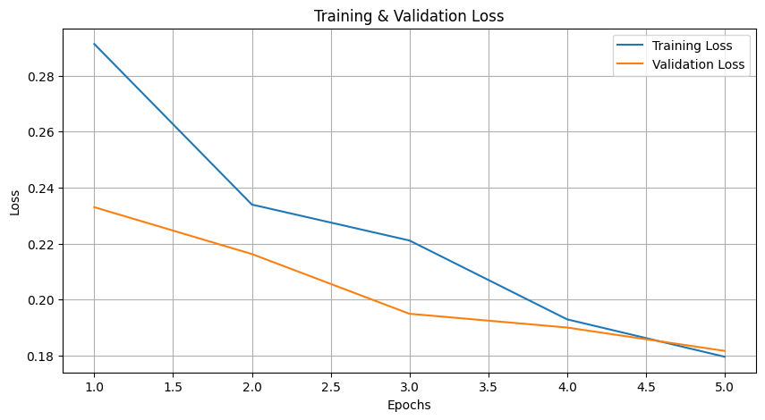
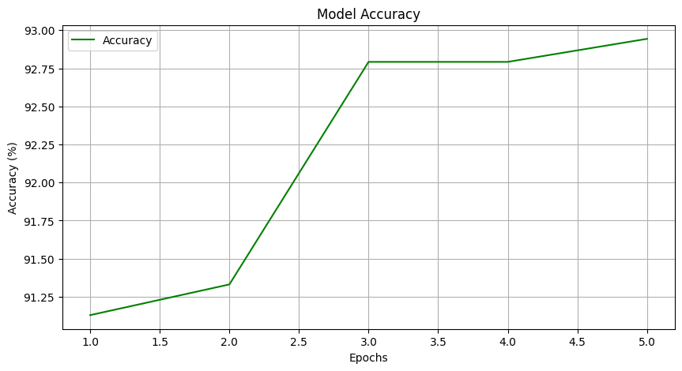
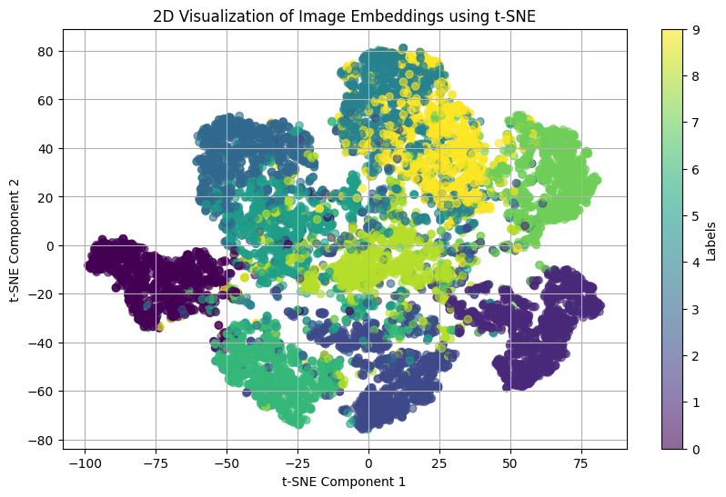

# 🤖 Siamese Neural Network for Similarity Learning

## 📖 Introduction

A **Siamese Neural Network (SNN)** is a specialized architecture designed to measure the similarity between two inputs, typically images. Instead of directly classifying inputs, SNNs learn a distance metric that helps determine whether pairs are similar or dissimilar.

### 🌟 Key Components:
- **Twin Networks** 👯: Two identical neural networks with shared weights, processing each input simultaneously.
- **Distance Metric** 📏: The networks output embeddings for each input, which are compared using a distance metric (commonly **Euclidean distance**).

---

## 🏗️ Architecture Overview

### 1. **Twin Networks** 👯
   - Each network processes one of the two input images.
   - Shared weights ensure consistent feature extraction from similar images.

### 2. **Feature Extraction** 🧩
   - Both networks convert their respective images into feature embeddings, resulting in lower-dimensional representations.
   - The output is a vector of features that succinctly encapsulates each image.

### 3. **Similarity Calculation** 📏
   - After generating embeddings, a **distance function** (like Euclidean distance) assesses the similarity or dissimilarity of the images based on their feature representations.

---

## 🔄 Training Procedure

### 1. **Input Data** 📥
   - Pairs of images are fed into the twin networks, with labels indicating similarity (`1` for similar, `0` for dissimilar).

### 2. **Embedding Generation** 🔍
   - The networks create embeddings for both images in each pair, capturing essential features.

### 3. **Distance Calculation** 📏
   - The **Euclidean distance** between the two embeddings is calculated, where a smaller distance signifies higher similarity.

### 4. **Loss Function** 🔧
   - The model utilizes **contrastive loss** to minimize the distance for similar pairs while maximizing it for dissimilar pairs.

### 5. **Optimization** 🛠️
   - The Siamese network is optimized using **Stochastic Gradient Descent (SGD)** or variants like **Adam**, adjusting weights to enhance performance in the similarity task.

---

## 📊 Contrastive Loss Function

The **contrastive loss** function drives the network to reduce the distance between embeddings of similar images while increasing the distance for dissimilar images.

The loss is computed as follows:

$$
\text{Loss}(Y, D_w) = (1 - Y) \cdot \frac{1}{2} \cdot D_w^2 + Y \cdot \frac{1}{2} \cdot \max(0, m - D_w)^2
$$

Where:
- \( Y \): Label (`0` for similar pairs, `1` for dissimilar pairs).
- \( D_w \): Distance between image embeddings.
- \( m \): Margin parameter, ensuring dissimilar pairs maintain a minimum distance.

---

## ⚠️ Challenges in Training Siamese Networks

- **Class Imbalance** ⚖️: Similarity datasets may contain more dissimilar pairs than similar ones, requiring careful balancing during dataset preparation.
- **Training Instability** ⛔: Optimizing the loss function can be tricky, particularly if the margin parameter is not well-tuned.
- **Embedding Quality** 🎯: The quality of generated embeddings is crucial for effective similarity detection.

---

## 📈 Plotting Loss and Accuracy

Monitoring the training process is vital for understanding model performance. Below are plots showcasing the training and validation loss, as well as the accuracy over epochs.

### Training and Validation Loss

This plot illustrates the **training and validation loss** over time, indicating how well the Siamese network performs during training:

> *Note: A decreasing loss signifies improved model performance and stability during training.*

### Accuracy Plot

This plot shows the **accuracy** on the validation dataset, reflecting the network's ability to distinguish between similar and dissimilar pairs:

> *Note: Higher accuracy indicates the model's effectiveness in similarity learning.*

---

## 🔍 Visualizing Embeddings

Visualizing the **image embeddings** produced by the network helps us understand how effectively it separates similar and dissimilar images in the feature space. Below is an example of a **2D projection** of the embeddings using techniques like **t-SNE** or **PCA**:

> *Note: This visualization reveals the clustering behavior of similar images in the feature space.*

---

## ✅ Conclusion

Once trained, this Siamese network can measure the similarity between any two new input images, making it a powerful tool for various applications such as image verification, signature verification, and more.

---

## ✨ Key Points to Remember
- Siamese networks excel at **pairwise comparison** tasks.
- The **shared weights** between twin networks ensure consistent processing of similar images.
- **Contrastive loss** is fundamental for training, guiding the network to learn meaningful distances between embeddings.

---
