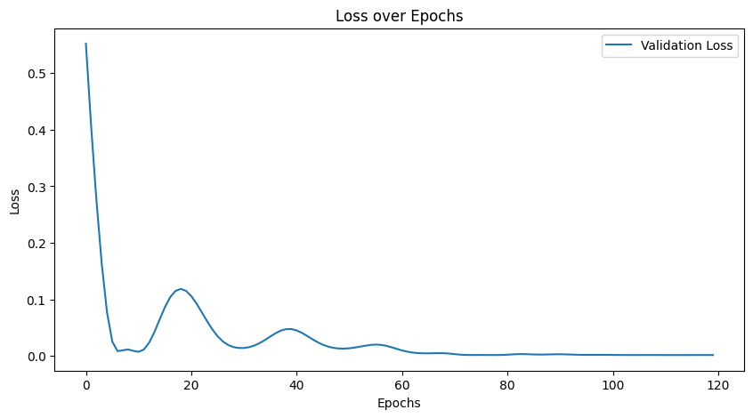
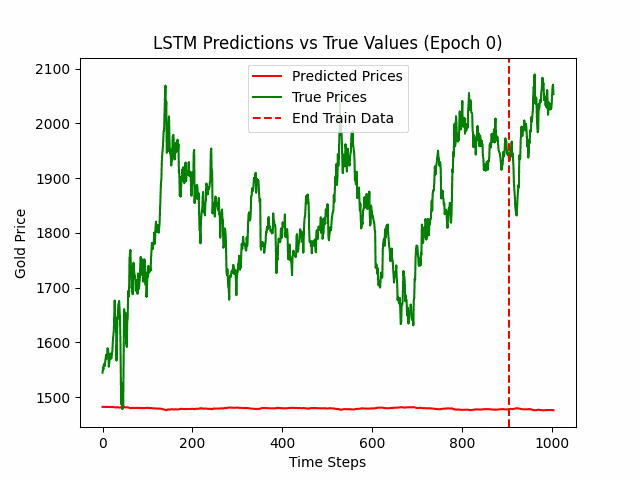
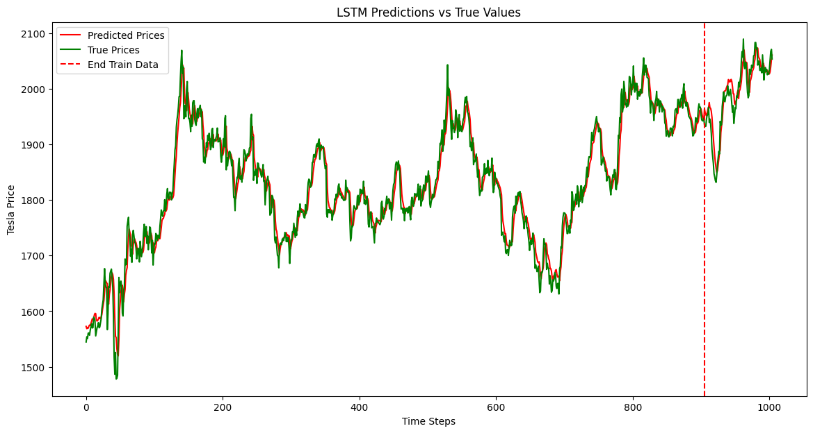

# Stock Price Prediction using LSTM

## Introduction

Long Short-Term Memory (LSTM) networks are a type of **Recurrent Neural Network (RNN)** specifically designed to model **sequential data**. LSTMs are well-suited for time series forecasting tasks like **stock price prediction** due to their ability to capture both **long-term dependencies** and **temporal patterns**.

This project demonstrates how LSTM networks can be used to predict stock prices based on historical data. The model learns from past prices and aims to forecast future values, providing insights for **traders, investors, and analysts**.

## Workflow

1. **Data Preprocessing**  
   - Normalize the prices to ensure stable training.
   - Create **rolling windows** of past data to feed into the LSTM for prediction. 

2. **LSTM Model Architecture**  
   - **Input**: Sequence of stock prices over a window (8 days). For this project, we used **Gold price data** from **2020 to 2024** to train the LSTM model. The historical gold prices were divided into **rolling windows**, allowing the model to learn sequential dependencies and predict future prices based on past trends. Each window serves as input, with the corresponding next time step used as the target.
   - **Hidden Layers**: LSTM layers to capture temporal dependencies.
   - **Output Layer**: A dense layer that predicts the stock price for the next time step.

3. **Training**  
   - Loss Function: Mean Squared Error (MSE) to minimize prediction error.
   - Optimizer: Adam optimizer.
   - Validation: Split data into training and validation sets for evaluation.

4. **Prediction and Evaluation**  
   - Use trained LSTM to predict stock prices on the **test data**.
   - Evaluate model performance using metrics such as **MSE**.
   - Visualize the predicted vs. actual stock prices for better interpretation.

---
## Loss Function in LSTM for Stock Price Prediction

The **loss function** is a critical component in training the LSTM model, as it quantifies the difference between the predicted and actual stock prices. For this project, we use the **Mean Squared Error (MSE)** loss function, which measures the average squared difference between predictions and actual values. MSE is ideal for regression tasks like stock price prediction because it **penalizes larger errors more heavily**, encouraging the model to minimize significant deviations.

During training, the LSTM model tries to minimize the MSE by adjusting its weights through **backpropagation** and the **Adam optimizer**. The trend of the loss function over epochs provides insights into the model’s learning progress. A **gradually decreasing loss** indicates that the model is learning to make better predictions, whereas a **stagnant or oscillating loss** may signal convergence issues or require tuning of hyperparameters.

Below is the plot showing the loss function over the course of training:

## Training Procedure of LSTM and Observed Patterns

Training an **LSTM for stock price prediction** involves feeding sequential data into the network, adjusting its internal states, and updating its weights through backpropagation over time. During each epoch, the model processes batches of time windows and learns to predict the next price based on historical data. The **Adam optimizer** is commonly used to minimize the loss function, ensuring that the network learns efficiently. Early in the training process, the predictions may appear erratic as the model struggles to capture the underlying patterns.

As training progresses, several patterns may emerge:
1. **Gradual Improvement**: Predictions align more closely with the actual prices as the model learns.
2. **Overfitting**: The model performs well on the training set but poorly on unseen data, signaling the need for regularization or early stopping.
3. **Training Instability**: The predictions fluctuate wildly over epochs, which may require adjusting the learning rate or network architecture.
4. **Convergence**: The model achieves stable, accurate predictions, indicating that it has learned to generalize well from the data.

Below is a GIF showing how the LSTM’s predictions improve over epochs, offering a visual representation of the model's learning progress:

## Visualization of Predictions

Below is a plot comparing the **predicted prices vs actual prices** on the test set. This visualization helps assess the model's ability to track the trends and fluctuations in stock prices:

