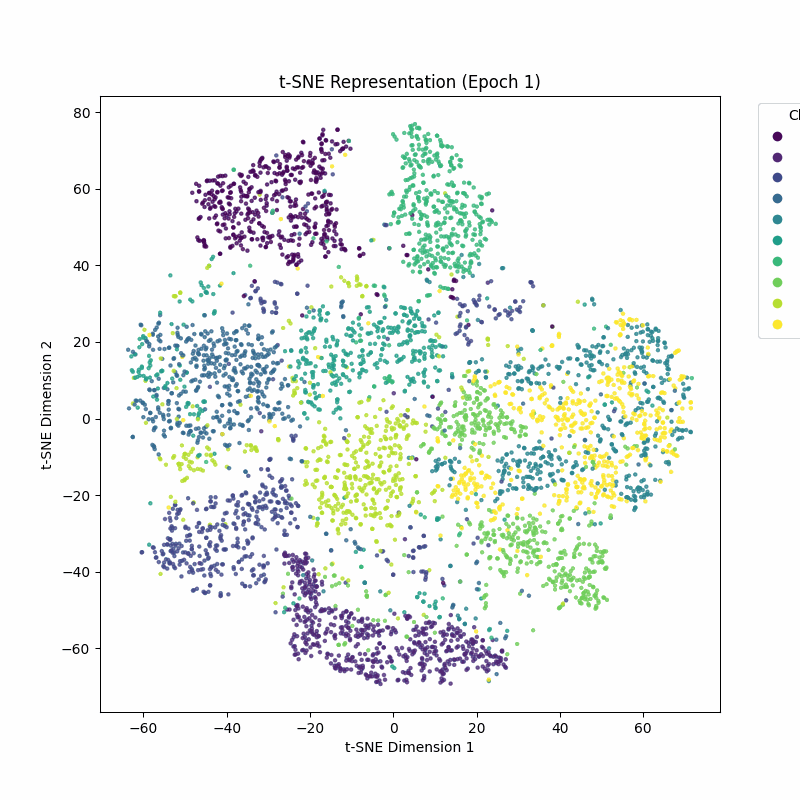
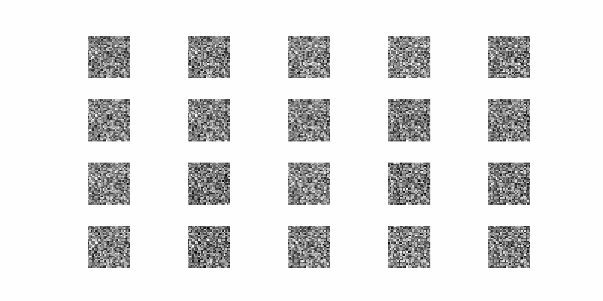
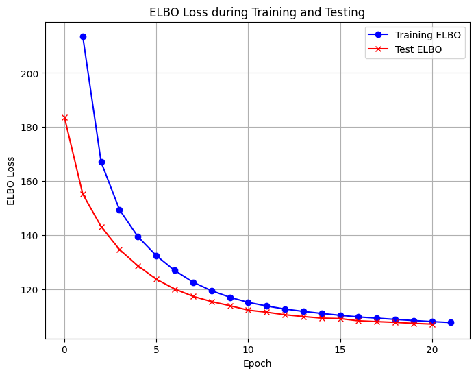
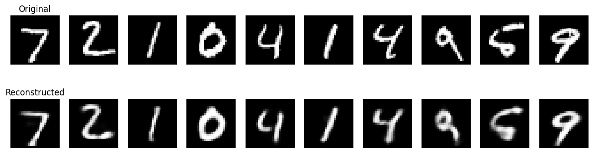

# Variational Autoencoders (VAE) 🧠
A **Variational Autoencoder (VAE)** is a type of generative model that learns to map input data to a latent space and generate new data points that resemble the input distribution. Unlike standard autoencoders, VAEs introduce probabilistic modeling to the latent space, making them powerful tools for generating new, meaningful samples.
---
## 📚 Key Concepts
### 1. **Encoder-Decoder Architecture**
- **Encoder**: Maps the input data `x` to a distribution over the latent space (typically modeled as a Gaussian).
- **Decoder**: Reconstructs the input from a latent variable `z` sampled from the latent space.

### 2. **Latent Space Regularization**
- Instead of encoding directly into a fixed latent vector, the encoder outputs parameters `(μ, σ)` of a Gaussian distribution.
- This ensures that the latent space follows a smooth, continuous structure.

### 3. **Loss Function (ELBO)**
The **Evidence Lower Bound (ELBO)** combines:
1. **Reconstruction Loss**: Measures how well the decoder reconstructs the input.
2. **KL Divergence**: Regularizes the latent space by penalizing the difference between the learned latent distribution and the prior distribution (usually $'\mathcal{N}(0, I)'$).  
Mathematically:

$\begin{equation}\mathcal{L} _ {recon} = \mathbb{E} _ {q(z\|x)}\left[ \log p(x\|z) \right]\end{equation}$  
$KL\left(q(z \mid x) \| \| p(z)\right) = \mathbb{E}_{q(z \mid x)}\left[\log \frac{q(z \mid x)}{p(z)}\right]$  
$ELBO = \mathcal{L} _ {recon} - KL\left(q(z \mid x) \| \| p(z)\right)$

---

## 🌟 Why VAEs?

1. **Generative Capability**: VAEs can generate new data points by sampling from the latent space.
2. **Smooth Latent Space**: Since VAEs regularize the latent space, small changes in latent variables lead to meaningful changes in generated outputs.
3. **Unsupervised Learning**: VAEs learn without labeled data, making them useful for many tasks like anomaly detection, synthetic data generation, and more.

---

## 🛠 Example Applications

- **Image Generation**: Generate realistic images from random latent vectors.
- **Latent Space Interpolation**: Create smooth transitions between two images by interpolating in the latent space.

## Learning Latent Representations

One of the core strengths of Variational Autoencoders (VAEs) is their ability to learn meaningful latent representations of the input data. During training, the model encodes the input data into a latent space, where similar data points are represented closer together. This learned latent representation captures the underlying structure of the data, allowing the model to generate new samples that are coherent and consistent with the training data.

The following animation illustrates how the VAE model learns these latent representations over time. Each frame shows the evolving structure of the latent space as the model trains on the input data. As training progresses, you can observe how data points cluster and how the model improves its ability to reconstruct the input.

*Figure: Animation showing how the VAE learns latent representations over training epochs.*

The latent space's structure is crucial for various applications, including data generation, interpolation, and anomaly detection. By visualizing how the model learns these representations, we gain insight into the model's performance and the characteristics of the data being processed.
## Generative Power of the Model

One of the most remarkable capabilities of Variational Autoencoders (VAEs) is their ability to generate new, high-quality samples that resemble the training data. By sampling from the learned latent space, the VAE can produce novel images that capture the essential features and variations present in the dataset. This generative power is particularly useful in applications such as image synthesis, data augmentation, and creative content generation. The following animation showcases the model's ability to generate images across different epochs of training. As the training progresses, you will observe a marked improvement in the quality and coherence of the generated images, highlighting the effectiveness of the VAE architecture in capturing complex data distributions.

*Figure: Animation demonstrating the generative capabilities of the VAE over training epochs.*

## Training Process and Loss Function

The training of a Variational Autoencoder (VAE) involves optimizing a loss function that balances the quality of the generated samples and the regularization of the latent space. The total VAE loss consists of two main components: the reconstruction loss, which measures how well the model can reconstruct the input data from the latent representation, and the KL divergence, which regularizes the latent space to adhere to a prior distribution (usually a standard Gaussian). During training, the model iteratively adjusts its parameters to minimize this loss, leading to improved reconstructions and better generative performance. The following plot illustrates the optimization of the loss function over the course of training, demonstrating a steady decrease in loss as the model learns:

*Figure: Plot showing the loss optimization during training.*

Additionally, after training is complete, the VAE can generate high-quality samples from the learned latent space. Below is an example of the final generated results, showcasing the model's ability to produce realistic images that reflect the underlying distribution of the training data:

*Figure: Example of images generated by the trained VAE.*

